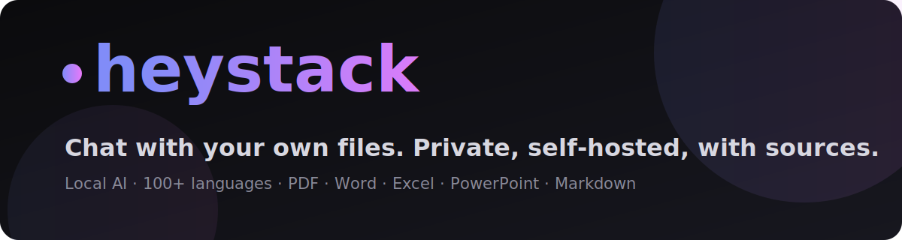
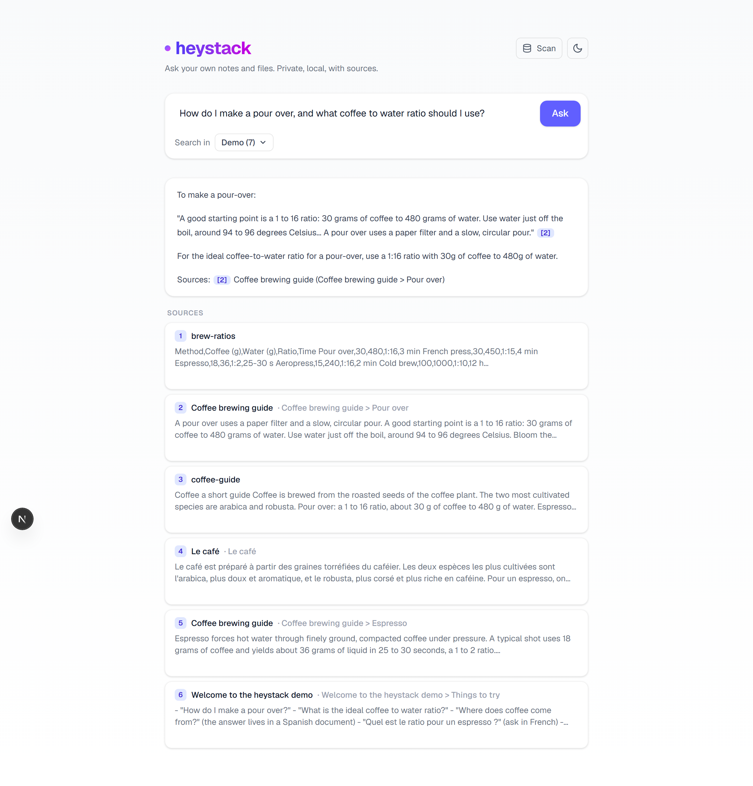
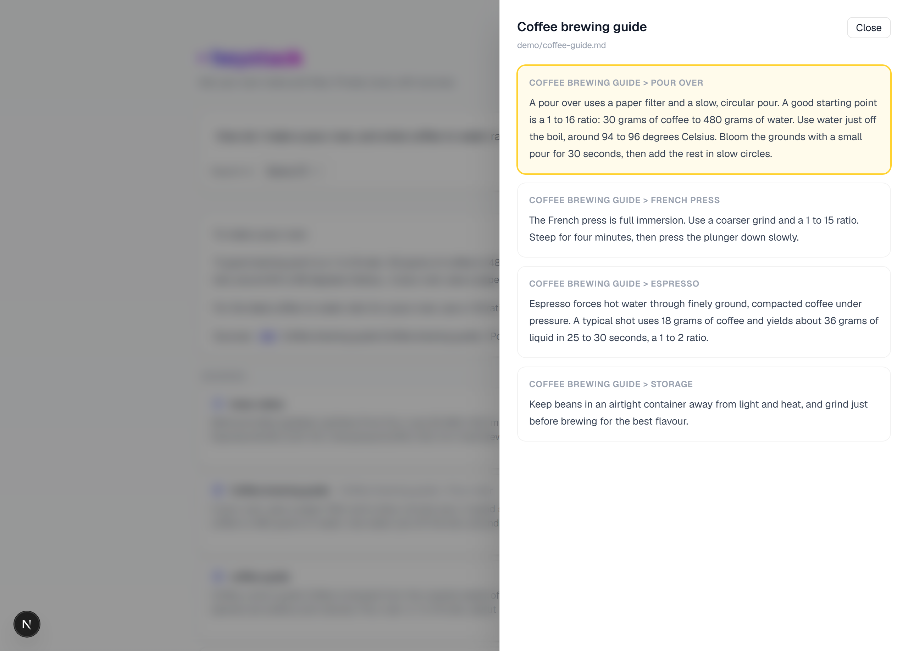
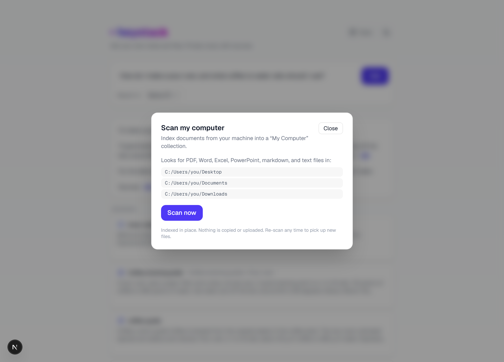
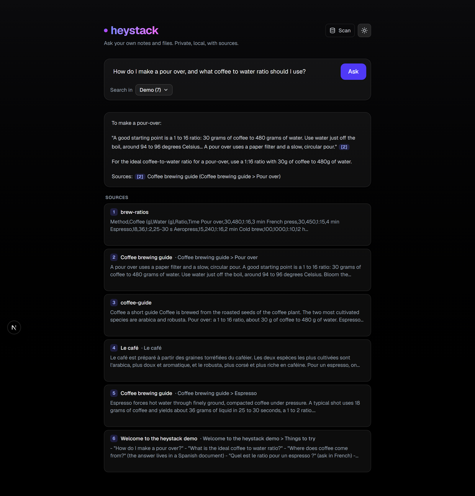
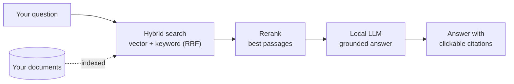
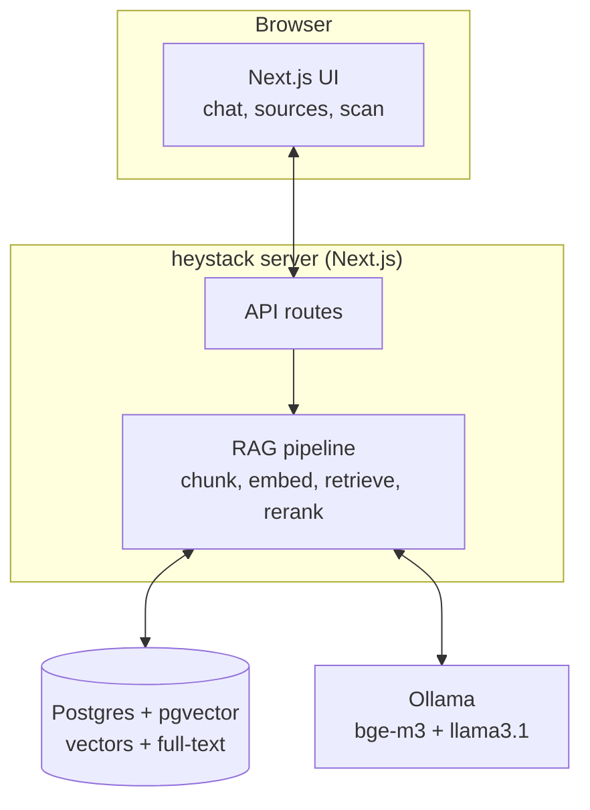

<div align="center">



<br/>

**Chat with your own files. Private, self-hosted, with sources.**
Runs free on your own hardware. Answers from _your_ stuff, in 100+ languages, and shows you exactly where every answer came from.

<br/>


[Quickstart](#-quickstart) &#183; [How it works](#-how-it-works) &#183; [Features](#-features) &#183; [Screenshots](#-screenshots) &#183; [Configuration](#-configuration)

</div>

---

> **Status: active development.** The retrieval pipeline, streaming chat, source
> viewer, multi-format ingestion, multilingual search, and one-command Docker
> deploy all work. Polishing toward a public release.

## Why heystack

Asking ChatGPT is like asking a clever stranger who has never read your notes.
**heystack is like asking a librarian who has read everything you wrote and points you to the exact page.**

- **It knows your stuff.** Answers come from your own documents, not the public internet.
- **It does not make things up.** Every answer is built from your files and cites them, so you can click and verify. If it is not in your documents, it says so.
- **It is private.** Your data never leaves your machine. Nothing uploaded, logged, or trained on.
- **It is free.** The AI runs locally via [Ollama](https://ollama.com). No subscription, no cost per question.
- **It is multilingual.** Ask in any language and find content in any language, by meaning. (English question, Greek document? No problem.)
- **You own it.** Works offline. Self-hosted with Docker or k3s.

## ✨ Features

| | |
|---|---|
| 🔎 **Quality retrieval** | Hybrid search (semantic + keyword) fused with RRF, then an LLM reranker picks the best passages |
| 🌍 **Multilingual & cross-lingual** | bge-m3 embeddings (100+ languages) + language-agnostic keyword search |
| 📄 **Many formats** | PDF, Word, Excel, PowerPoint, Markdown/MDX, and plain text |
| 🧾 **Trustworthy answers** | Streamed token-by-token with clickable `[n]` citations |
| 👁️ **Open the source** | Click any citation to open the real document — PDFs embedded, spreadsheets as tables, the cited passage highlighted |
| 🖥️ **Scan my computer** | Point it at your Desktop/Documents/Downloads and it indexes everything supported |
| 🪶 **Obsidian connector** | Live-sync a vault (wiki-links, tags, deletions) |
| 🎨 **Beautiful UI** | Light/dark themes, responsive, clean |
| 🐳 **One-command deploy** | `docker compose up` — app + Postgres, optional Ollama |

## 🖼️ Screenshots

Captured from the bundled demo data. Regenerate with [`scripts/screenshots.mjs`](scripts/screenshots.mjs).

| Ask, with sources | Open the cited source |
|---|---|
|  |  |

| Scan your computer | Dark theme |
|---|---|
|  |  |

## 🧠 How it works

`retrieval + generation = RAG`. Search alone just lists files. AI alone makes things up. Together you get trustworthy answers from your own knowledge.



## 🏗️ Architecture

TypeScript end to end. One Postgres holds vectors **and** full-text. Ollama runs the models locally.



## 🚀 Quickstart

**Requirements:** Docker, and [Ollama](https://ollama.com) running locally.

```bash
# 1. Pull the models (bge-m3 = multilingual embeddings, llama3.1 = chat)
ollama pull bge-m3
ollama pull llama3.1:8b

# 2. Configure and start
cp .env.example .env
docker compose up -d

# 3. Add some documents (a file or a whole folder)
npm install
npm run ingest -- "/path/to/your/docs" "My Docs"

# 4. Open the app
# http://localhost:3000
```

Prefer Ollama in a container too? `docker compose --profile ollama up -d` and set `OLLAMA_BASE_URL=http://ollama:11434` in `.env`.

### Try the demo

Load a small, neutral demo knowledge base (a multilingual coffee guide in
Markdown, CSV, and PDF) so you have something to chat with right away:

```bash
npm run seed     # loads demo/ into a "Demo" collection
```

Then open the app and try, for example, _"where does coffee come from?"_ (the
answer is in a **Spanish** document) or _"how much caffeine is in a cup?"_
(**German**) — heystack finds them across languages.

### Bring in documents

```bash
# Any file or folder (PDF, Word, Excel, PowerPoint, Markdown, text)
npm run ingest -- "C:/path/to/folder" "My Docs"

# An Obsidian vault, kept in sync as you edit
npm run obsidian -- "C:/path/to/Vault" "My Vault" --watch
```

Or open the app and use **Scan my computer** (top-right) to index your Desktop, Documents, and Downloads.

### Local development

```bash
npm install
docker compose up -d db    # just Postgres
npm run dev                # http://localhost:3000
```

## 📁 Supported files

| Type | Extensions | How it is read |
|------|-----------|----------------|
| Markdown | `.md`, `.mdx` | Structure-aware, frontmatter parsed, MDX import noise stripped |
| PDF | `.pdf` | Text extracted; embedded as-is in the viewer |
| Word | `.docx` | Text via mammoth |
| Excel | `.xlsx`, `.xls` | One section per sheet (CSV), rendered as tables |
| PowerPoint | `.pptx` | Text via officeparser |
| CSV | `.csv` | Rendered as a table |
| Text | `.txt` | As-is |

## ⚙️ Configuration

All via environment (`.env`). Sensible local defaults.

| Variable | Default | Notes |
|----------|---------|-------|
| `OLLAMA_BASE_URL` | `http://localhost:11434` | Where Ollama runs |
| `EMBEDDING_MODEL` | `bge-m3` | Multilingual, 1024-dim. Use `nomic-embed-text` for English-only (768) |
| `EMBEDDING_DIM` | `1024` | Must match the model **and** the `vector(...)` column in `db/init.sql` |
| `CHAT_MODEL` | `llama3.1:8b` | Any Ollama chat model |
| `RERANK_MODEL` | (chat model) | Model used to rerank passages |
| `ENABLE_RERANK` | `true` | Set `false` to skip reranking (faster, slightly lower quality) |
| `SCAN_ROOTS` | Desktop/Documents/Downloads | Comma-separated folders for "Scan my computer" |
| `DATABASE_URL` | local Postgres | Postgres + pgvector connection |
| `OPENAI_API_KEY` | (empty) | Optional cloud fallback; leave empty to stay fully local |

## 🌐 Hosting a public demo

heystack runs the models locally, so a public demo needs a host that can run
Ollama (a GPU box is much faster). To make a shared instance safe:

- Set **`NEXT_PUBLIC_DEMO_MODE=true`** — hides "Scan my computer" and disables the
  scan API, so it cannot read the server's filesystem.
- Seed it with neutral content: `npm run seed`.
- Put it behind a reverse proxy with **rate limiting** — every question runs an LLM.

For a personal instance on your own machine, leave demo mode off and enjoy the
full feature set.

## 🗂️ Project layout

```
src/
  app/                 Next.js UI + API routes (chat, collections, documents, scan)
  components/          theme toggle, collection picker, source viewer, scan modal
  db/                  Drizzle schema + client
  lib/
    ollama.ts          local embeddings + chat (streaming)
    scan.ts            "scan my computer" engine
    rag/
      extract.ts       read pdf/docx/xlsx/pptx/md/txt -> text
      chunk.ts         structural, markdown-aware chunking
      ingest.ts        chunk -> embed -> store (NFKC normalized)
      retrieve.ts      hybrid search (vector + full-text) fused with RRF
      rerank.ts        LLM reranker
      ask.ts           retrieve -> rerank -> grounded, streamed answer + citations
    connectors/obsidian.ts   vault sync (wiki-links, tags, live watch)
scripts/               ingest + obsidian CLIs
db/init.sql            schema + pgvector (HNSW) and full-text (GIN) indexes
docker-compose.yml     app + Postgres (+ optional Ollama)
```

## 🛣️ Roadmap

- [x] Hybrid retrieval + reranker, streaming answers, clickable sources
- [x] PDF / Word / Excel / PowerPoint / Markdown / text ingestion
- [x] Multilingual & cross-lingual search (bge-m3)
- [x] Obsidian connector, collection picker, scan-my-computer
- [ ] Public demo instance
- [ ] OCR for scanned PDFs
- [ ] Multi-user auth
- [ ] k3s / Helm chart

## 🤝 Contributing

Issues and PRs are welcome. It is a standard Next.js + TypeScript app: `npm install`, run Postgres with `docker compose up -d db`, then `npm run dev`.

## License

[MIT](LICENSE)
